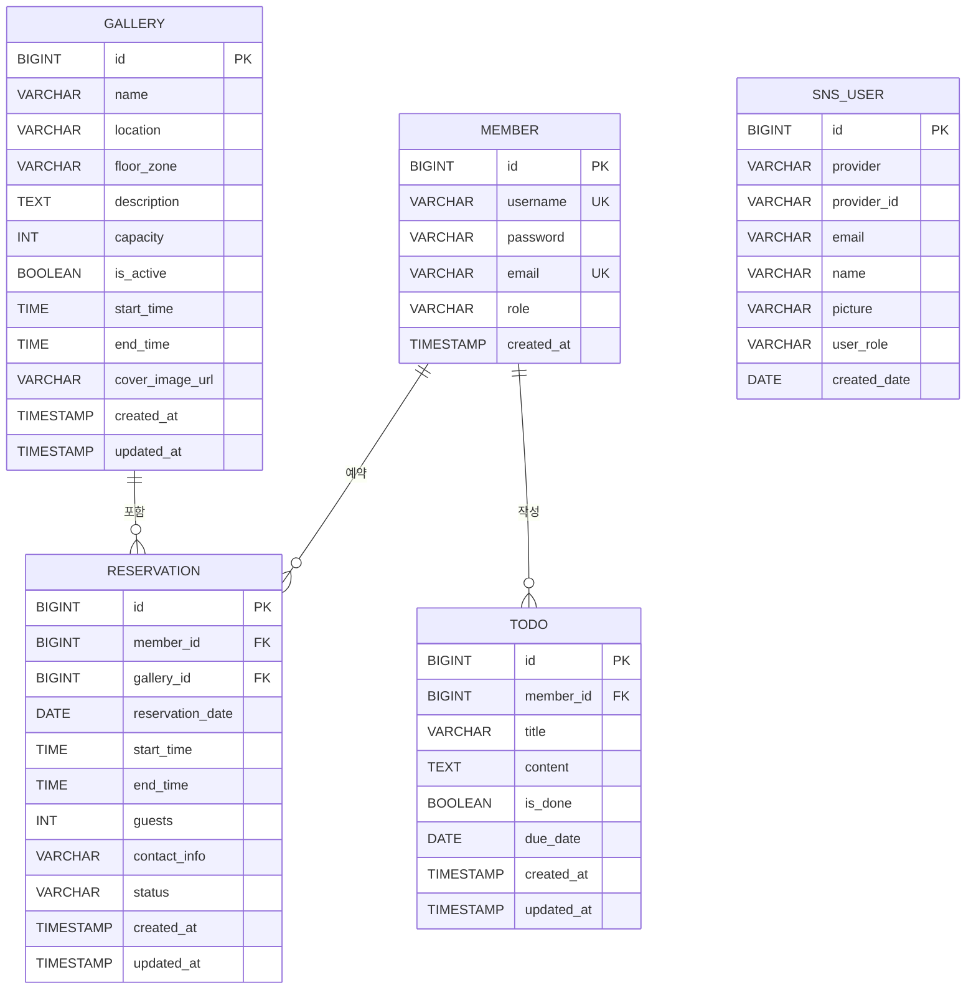

# 🖼️ Gallery Reservation

미술관 갤러리 예약 및 관리 웹 애플리케이션입니다.
사용자는 갤러리를 조회하고 예약을 신청할 수 있으며, 관리자는 갤러리와 예약을 관리할 수 있습니다.

---

## 📌 주요 기능

### 👤 회원
- 일반 회원가입 / 로그인
- **소셜 로그인** (카카오, 네이버)
- 일반 로그인 / 소셜 로그인 모두 동일한 기능 이용 가능

### 🗓️ 예약
- 갤러리 예약 신청 (날짜, 시간 선택)
- 내 예약 목록 조회
- 예약 취소
- 예약 상태: `대기중 → 승인 / 거절 / 취소`

### ✅ 할 일 (Todo)
- 개인 할 일 등록 / 수정 / 삭제
- 완료 여부, 마감일 관리
- 키워드 검색 및 완료 여부 필터링

### 🏛️ 갤러리 (관리자)
- 갤러리 등록 / 수정 / 비활성화
- 층/구역 정보, 수용 인원, 운영 시간 관리
- 예약 승인 / 거절 처리

---

## 🛠️ 기술 스택

| 분류 | 기술 |
|------|------|
| Language | Java 21 |
| Framework | Spring Boot 3.4.1 |
| ORM | Spring Data JPA |
| View | Thymeleaf |
| Security | Spring Security 6 + OAuth2 Client |
| Database | PostgreSQL (Supabase) |
| Build | Gradle |
| Etc | Lombok |

---

## 📁 프로젝트 구조

```
src/main/java/com/study/galleryreservation/
├── config/                         # 설정 클래스
│   ├── SecurityConfig.java         # Spring Security 설정
│   ├── CustomAuthenticationSuccessHandler.java
│   ├── OAuthAttributes.java        # OAuth2 속성 매핑
│   └── CustomUserDetailsService.java
│
├── controller/                     # 컨트롤러
│   ├── AdminController.java        # 관리자 전용 (갤러리 관리, 예약 승인)
│   ├── MemberController.java       # 회원가입 / 로그인
│   ├── ReservationController.java  # 예약 신청 / 조회 / 취소
│   ├── TodoController.java         # 할 일 CRUD
│   └── ViewController.java         # 공통 뷰 라우팅
│
├── domain/                         # 엔티티
│   ├── gallery/Gallery.java
│   ├── member/Member.java
│   ├── member/MemberRole.java
│   ├── reservation/Reservation.java
│   ├── reservation/ReservationStatus.java
│   └── todo/Todo.java
│
├── dto/                            # DTO
│   ├── gallery/
│   ├── member/
│   ├── reservation/
│   └── todo/
│
├── repository/                     # JPA 레포지토리
│   ├── GalleryRepository.java
│   ├── MemberRepository.java
│   ├── ReservationRepository.java
│   └── TodoRepository.java
│
└── service/                        # 서비스
    ├── GalleryService.java
    ├── MemberService.java
    ├── ReservationService.java
    ├── TodoService.java
    └── CustomOAuth2UserService.java

src/main/resources/
├── templates/
│   ├── index.html                  # 메인 페이지
│   ├── admin/                      # 관리자 페이지
│   ├── gallery/                    # 갤러리 목록/상세
│   ├── member/                     # 로그인/회원가입
│   ├── reservation/                # 예약 폼/목록
│   └── todo/                       # 할 일 폼/목록/수정
├── application.yml
└── db.sql                          # 테이블 DDL
```

---

## 🗄️ ERD



| 테이블 | 설명 |
|--------|------|
| member | 회원 정보 (아이디, 비밀번호, 이메일, 권한) |
| gallery | 갤러리 공간 정보 (위치, 수용인원, 운영시간, 커버이미지) |
| reservation | 예약 정보 (날짜, 시간, 인원, 연락처, 상태) |
| todo | 할 일 정보 (제목, 내용, 마감일, 완료 여부) |
| sns_user | 소셜 로그인 사용자 정보 (provider, 역할) |

---

## 🔐 권한 구조

| 역할 | 접근 가능 기능 |
|------|--------------|
| `ROLE_USER` | 갤러리 조회, 예약 신청/취소 |
| `ROLE_ADMIN` | 모든 기능 + 갤러리 관리 + 예약 승인/거절 |

---

## 🔑 소셜 로그인

카카오, 네이버 OAuth2 로그인을 지원합니다.
소셜 로그인 최초 시 Member 테이블에 자동으로 회원 등록되며, 이후 일반 로그인 회원과 동일하게 서비스를 이용할 수 있습니다.

| Provider | username 형식 |
|----------|-------------|
| 카카오 | `kakao_{providerId}` |
| 네이버 | `naver_{providerId}` |

---

## ⚙️ 실행 방법

### 1. 환경 변수 / application.yml 설정

```yaml
spring:
  datasource:
    url: jdbc:postgresql://{supabase_host}:5432/postgres
    username: postgres
    password: {your_password}
  security:
    oauth2:
      client:
        registration:
          kakao:
            client-id: {kakao_client_id}
            client-secret: {kakao_client_secret}
          naver:
            client-id: {naver_client_id}
            client-secret: {naver_client_secret}
```

### 2. 데이터베이스 초기화

```sql
-- src/main/resources/db.sql 실행
```

### 3. 빌드 및 실행

```bash
./gradlew bootRun
```

브라우저에서 `http://localhost:8080` 접속

---

## 📸 서비스 화면

| 메인 페이지 | 로그인 |
|:-----------:|:------:|
|  |  |

| 갤러리 목록 | 관리자 갤러리 관리 |
|:-----------:|:----------------:|
|  |  |

---

## 📄 주요 URL

| URL | 설명 |
|-----|------|
| `/` | 메인 페이지 |
| `/member/join` | 회원가입 |
| `/member/login` | 로그인 |
| `/gallery/list` | 갤러리 목록 |
| `/reservation/form` | 예약 신청 |
| `/reservation/list` | 내 예약 목록 |
| `/todo/list` | 할 일 목록 |
| `/todo/form` | 할 일 등록 |
| `/admin/gallery/list` | 갤러리 관리 (관리자) |
| `/admin/gallery/form` | 갤러리 등록 (관리자) |
| `/admin/reservation/list` | 예약 관리 (관리자) |
