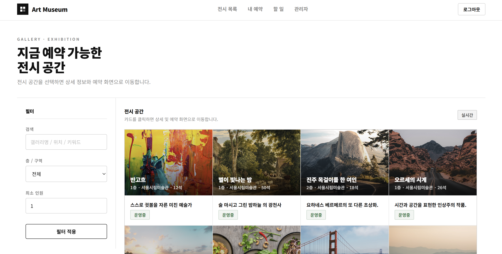
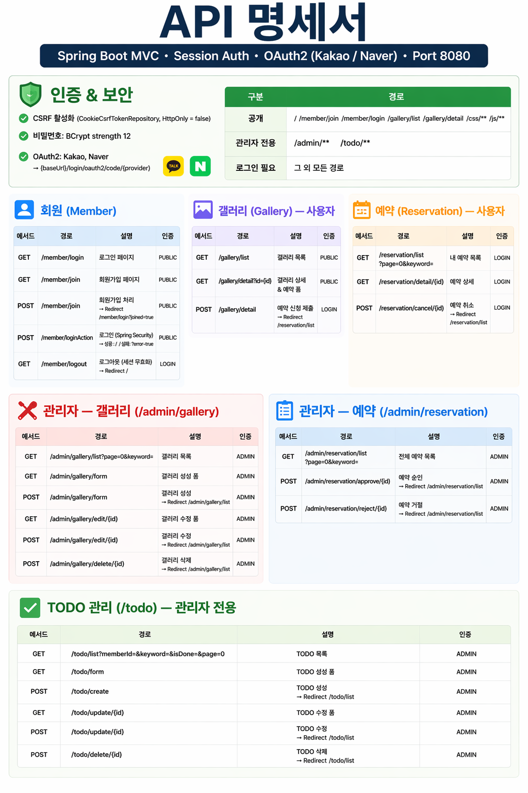
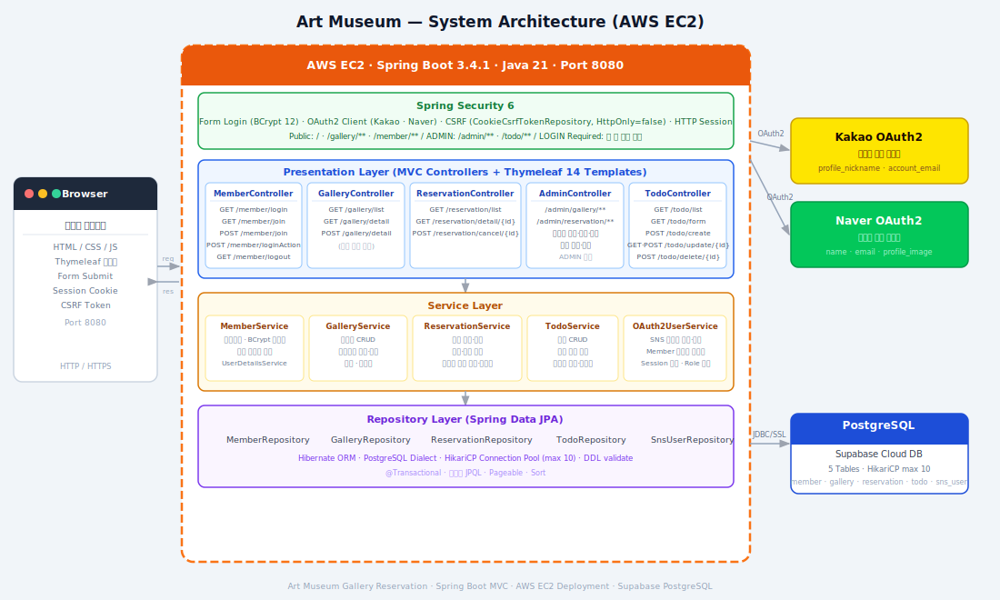
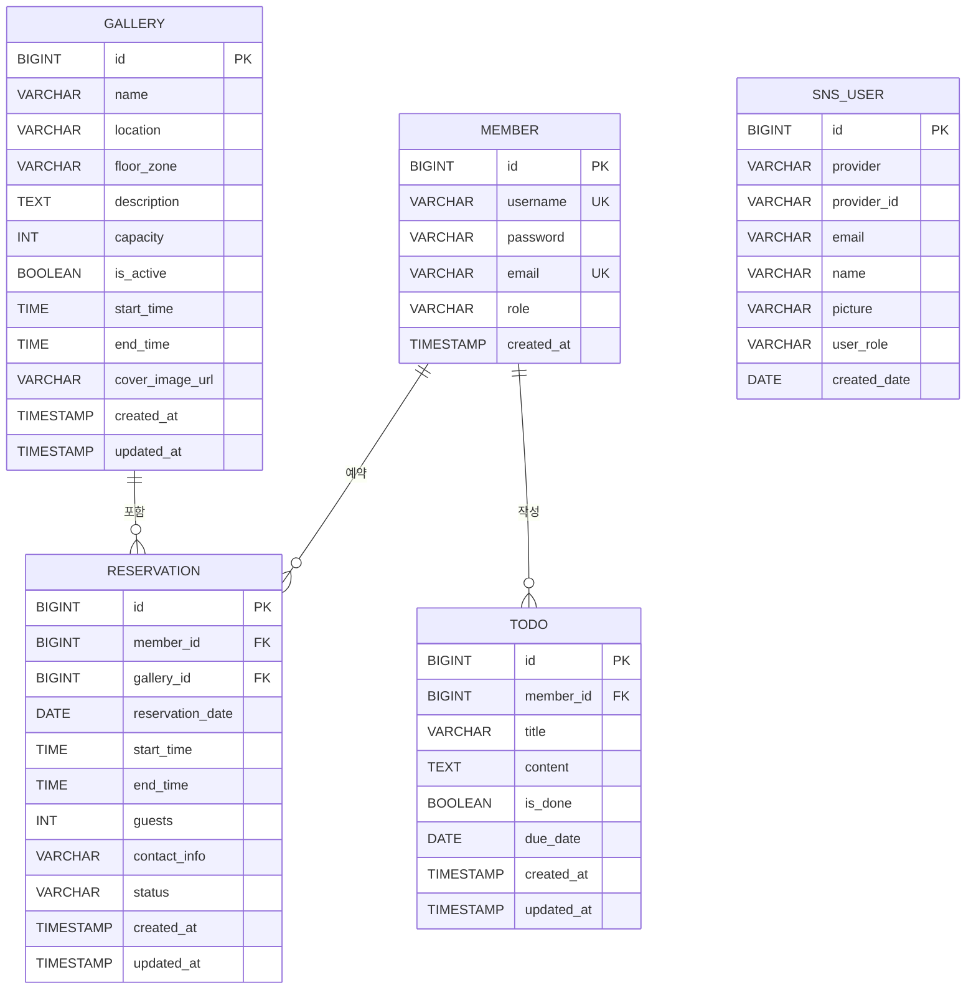

# 🖼️ Art Museum - 미술관 갤러리 예약 플랫폼

## 🎨 프로젝트 소개

🏷 **프로젝트 명 : Art Museum**

🗓️ **프로젝트 기간 : 2026.03 ~ 2026.04.08**

👥 **구성원 : 김태혁(팀장👑), 김민준, 이유리, 박준현**

---

### ✅ 기획 배경

> "미술관을 더 편하게, 더 스마트하게"

평소 미술관에 관심이 많아 갤러리 공간을 직접 예약하고 관리할 수 있는 서비스를 기획하게 되었습니다.
사용자는 원하는 갤러리 공간을 탐색하고 날짜와 시간을 선택해 예약을 신청할 수 있으며,
관리자는 갤러리 등록부터 예약 승인까지 통합적으로 관리할 수 있습니다.

---

### ✅ 서비스 소개

> 미술관 갤러리 공간을 온라인으로 예약할 수 있는 플랫폼

- 갤러리 공간을 탐색하고 날짜·시간·인원을 선택해 예약 신청할 수 있다.
- 관리자는 갤러리를 등록/수정하고 예약을 승인/거절할 수 있다.
- 카카오, 네이버 소셜 로그인을 지원한다.

---

### 👥 서비스 대상

- 미술관 갤러리 공간을 대관하고 싶은 사람들
- 전시 공간을 편리하게 예약하고 싶은 사람들

---

## 🛠 기술 스택

### Backend
<p>
  
  
  
  
  
  
</p>

### Database
<p>
  
</p>

### Build & Infra
<p>
  
  
</p>

---

## 💌 서비스 화면 및 기능 소개

### ✅ 메인


---

### ✅ 회원

- **회원가입 / 로그인**
> 이메일과 비밀번호로 회원가입 및 로그인할 수 있다.

- **소셜 로그인**
> 카카오, 네이버 OAuth2 소셜 로그인을 지원한다.


---

### ✅ 갤러리 조회

- **갤러리 목록 조회**
> 전체 갤러리 목록을 커버 이미지, 위치, 수용 인원과 함께 확인할 수 있다.

- **갤러리 상세 조회 및 예약 신청**
> 갤러리 상세 페이지에서 날짜, 30분 단위 시간 슬롯, 인원, 연락처를 선택해 바로 예약 신청할 수 있다.



---

### ✅ 예약 관리

- **내 예약 목록 조회**
> 신청한 예약 목록을 페이지네이션과 갤러리명 검색으로 조회할 수 있고, 대기 중인 예약을 취소 신청할 수 있다.


> `대기중 → 승인 / 거절 / 취소`

- **예약 상세 조회**
> 갤러리 커버 이미지와 함께 예약 정보를 상세하게 확인할 수 있다.


---

### ✅ 관리자 페이지

- **갤러리 관리**
> 갤러리 등록, 수정, 삭제 및 운영 상태(운영중/비활성화)를 관리할 수 있다.
 


- **갤러리 등록**
> 갤러리 등록, 수정, 삭제 및 운영 상태(운영중/비활성화)를 관리할 수 있다.


- **갤러리 수정**
> 갤러리 등록, 수정, 삭제 및 운영 상태(운영중/비활성화)를 관리할 수 있다.


- **예약 승인/거절**
> 전체 예약 목록을 조회하고 예약을 승인하거나 거절할 수 있다.


---

### ✅ 할일 페이지

- **할일 등록/수정**
> 전체 예약 목록을 조회하고 예약을 승인하거나 거절할 수 있다.


---

## 📡 API 명세



---

## 🏗 시스템 아키텍처



---

## 🗂 프로젝트 구조

```
src/main/java/com/study/galleryreservation/
├── config/                         # 설정 클래스
│   ├── SecurityConfig.java         # Spring Security 설정
│   ├── CustomAuthenticationSuccessHandler.java
│   ├── OAuthAttributes.java        # OAuth2 속성 매핑
│   └── CustomUserDetailsService.java
│
├── controller/                     # 컨트롤러
│   ├── AdminController.java        # 관리자 전용 (갤러리 관리, 예약 승인)
│   ├── MemberController.java       # 회원가입 / 로그인
│   ├── ReservationController.java  # 예약 신청 / 조회 / 취소
│   ├── TodoController.java         # 할 일 CRUD
│   └── ViewController.java         # 공통 뷰 라우팅
│
├── domain/                         # 엔티티
│   ├── gallery/Gallery.java
│   ├── member/Member.java
│   ├── member/MemberRole.java
│   ├── reservation/Reservation.java
│   ├── reservation/ReservationStatus.java
│   └── todo/Todo.java
│
├── dto/                            # DTO
│   ├── gallery/
│   ├── member/
│   ├── reservation/
│   └── todo/
│
├── repository/                     # JPA 레포지토리
│   ├── GalleryRepository.java
│   ├── MemberRepository.java
│   ├── ReservationRepository.java
│   └── TodoRepository.java
│
└── service/                        # 서비스
    ├── GalleryService.java
    ├── MemberService.java
    ├── ReservationService.java
    ├── TodoService.java
    └── CustomOAuth2UserService.java

src/main/resources/
├── templates/
│   ├── index.html                  # 메인 페이지
│   ├── admin/                      # 관리자 페이지
│   ├── gallery/                    # 갤러리 목록/상세
│   ├── member/                     # 로그인/회원가입
│   ├── reservation/                # 예약 폼/목록
│   └── todo/                       # 할 일 폼/목록/수정
├── application.yml
└── db.sql
```

---

## 📜 프로젝트 산출물

### ERD



---

## 💙 팀원 소개

| 김태혁(팀장👑) | 김민준 | 이유리               | 박준현 |
|---|---|-------------------|---|
| Back-End | Back-End | Back-End          | Back-End |
| 회원가입 / 로그인 | 할 일(Todo) 기능 구현 | Front-End / UX,UI | 갤러리 기능 구현 |
| 소셜 로그인 (카카오, 네이버) | 할 일 등록 / 수정 / 삭제 | 예약 기능 구현          | 갤러리 목록 / 상세 |
| Spring Security 설정 | | 예약 목록 / 상세 / 취소   | |
| 관리자 페이지 | |                   | |